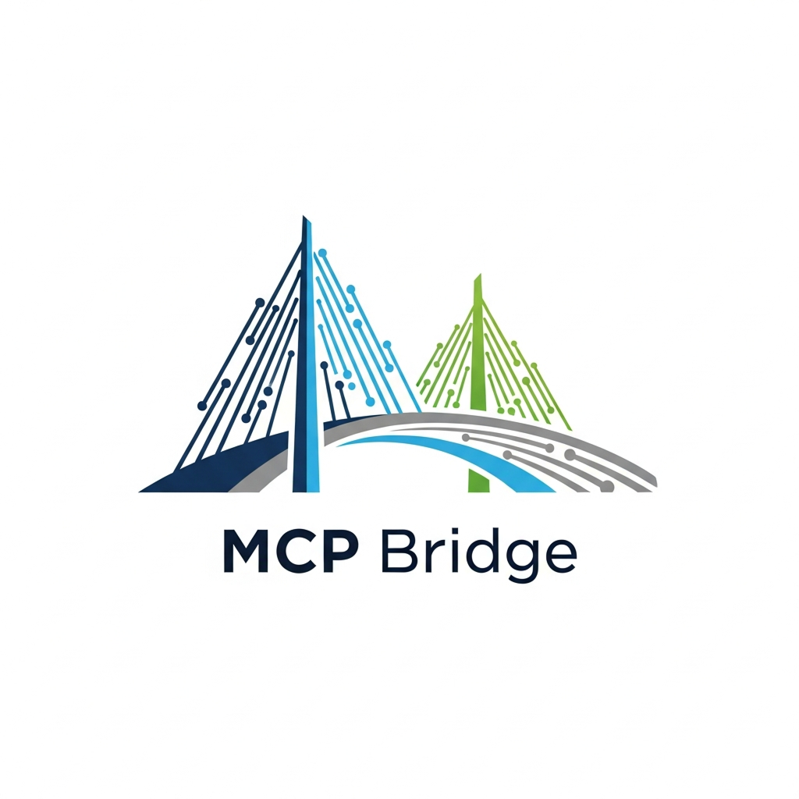

<p align="center">
  
</p>

# F-MCP (Figma MCP Bridge)

Figma tasarım verilerini ve işlemlerini Model Context Protocol (MCP) ile AI asistanlarına (Claude, Cursor vb.) açan MCP sunucusu ve Figma plugin'i. Bu repo MCP sunucusu ve **F-MCP Bridge** Figma plugin kaynağını içerir.

**Proje düzeni:** `src/`, `dist/` ve `f-mcp-plugin` bu depo **kökündedir.** Yerel MCP config ve dokümanlardaki yollar `…/<clone>/dist/...` ve `…/<clone>/f-mcp-plugin/...` şeklinde olmalıdır.

**Eski kurulum:** MCP `args` içinde `…/f-mcp-bridge/dist/...` varsa `…/<clone-kökü>/dist/...` yapın. Launch Agent, `.app` ve ayrıntılı adımlar için [KURULUM.md](KURULUM.md) içindeki **«Eski f-mcp-bridge alt yolundan geçiş»** bölümüne bakın.

### Figma API token tüketmiyor

figma-mcp-bridge, Figma'nın **REST API'sini kullanmıyor**. Akış:

**Claude (MCP) → figma-mcp-bridge → Plugin → Figma (Desktop veya Tarayıcı)**

Sorgular doğrudan Figma içinde çalışan plugin üzerinden gider — hem masaüstü uygulaması hem tarayıcı sürümü (figma.com) desteklenir. Bu sayede:

- Figma API token tüketimi **yok** (REST API hiç çağrılmıyor)
- Rate limit yok
- Figma tarafında ücretlendirme yok
- Desktop'ta internet bağlantısı gerekmez; tarayıcı Figma'da yalnızca figma.com erişimi yeterli

**Ne tüketiliyor?** Sadece AI tarafı: bu konuşmadaki context token'ları. Her tool call'ın request/response'u context penceresine girer. Büyük dosyalarda çok derin sorgular (örn. `depth: 3`, `verbosity: full`) Claude context'ini hızlı doldurabilir; Figma tarafında ek maliyet oluşmaz.

### Zero Trust

Veri **yalnızca sizin ortamınızda** kalır. Tasarım içeriği Figma bulutuna MCP üzerinden **gönderilmez**; akış Claude → MCP (yerel) → Plugin (yerel) → Figma (Desktop veya Tarayıcı). 

REST API çağrısı ve Figma'ya tasarım verisi aktarımı yoktur. Bu sayede kurumsal güvenlik ve gizlilik politikalarına uyum kolaylaşır (Zero Trust: sunucuya güvenme, yerelde doğrula).

### Kurumlar için özet

- **Debug modu kapalı.** Figma'yı normal açarsınız; ekstra debug portu veya geliştirici ayarı gerekmez.
- **Kendi plugin story'nizde yayınlama.** Plugin'i Figma Organization (veya Enterprise) altında kendi plugin story'nize yayınladığınızda tüm kullanıcılar **Plugins** menüsünden tek tıkla erişir; "manifest import" zorunluluğu kalkar, merkezi ve erişilebilir bir mimari olur.
- **KVKK / GDPR uyumu.** Tasarım verisi yalnızca kullanıcının makinesinde (MCP + Plugin + Figma Desktop) kalır; Figma bulutuna veya üçüncü tarafa MCP üzerinden gönderilmez. Veri minimizasyonu ve yerelde işleme, hassas kurumsal ekipler ve denetim gereksinimleri için uygun bir model sunar.

## F-MCP yetenekleri

**33 araç** (config'te `dist/local-plugin-only.js` kullanıldığında tamamı aktif). Tam liste: [TOOLS_FULL_LIST.md](docs/TOOLS_FULL_LIST.md). Aşağıda rollerine göre özet.

### Ürün yöneticileri (analiz, kabul kriterleri, kurumsal süreçler)


| Kullanım                          | Araçlar                                                           | Açıklama                                                                                                    |
| --------------------------------- | ----------------------------------------------------------------- | ----------------------------------------------------------------------------------------------------------- |
| Tasarım envanteri ve analiz       | `figma_get_design_system_summary`, `figma_get_file_data`          | Özet, bileşen sayıları, token koleksiyonları; büyük dosyada varsayılan **currentPageOnly** (timeout önlemi) |
| Kabul kriterleri ve dokümantasyon | `figma_get_component_for_development`, `figma_capture_screenshot` | Bileşen spec + görsel; test ve kabul için referans                                                          |
| Design–code uyumu (gap analizi)   | `figma_check_design_parity`                                       | Figma token'ları ile kod token'larını karşılaştırır; kurumsal raporlama ve test kriterleri                  |
| Keşif ve durum                    | `figma_search_components`, `figma_get_status`, `figma_list_connected_files` | Bileşen arama, bağlantı kontrolü, bağlı dosya listesi (multi-client)                                       |


### Geliştiriciler


| Kullanım                      | Araçlar                                                                                                                                                   | Açıklama                                                                                                                       |
| ----------------------------- | --------------------------------------------------------------------------------------------------------------------------------------------------------- | ------------------------------------------------------------------------------------------------------------------------------ |
| Bileşen ve implementasyon     | `figma_get_component`, `figma_get_component_for_development`, `figma_get_component_image`, `figma_instantiate_component`, `figma_set_instance_properties` | Metadata, screenshot, instance oluşturma ve property güncelleme                                                                |
| Token ve stil kodu            | `figma_get_variables`, `figma_get_styles`                                                                                                                 | Değişkenler ve stiller (CSS/Tailwind/TS export)                                                                                |
| Dosya yapısı / design context | `figma_get_file_data`, `figma_get_design_context`                                                                                                         | Yapı, metin, layout, renk, font; SUI bileşen/token adı, layoutSummary, colorHex, fillVariableNames; outputHint: react/tailwind |
| Çalıştırma ve doğrulama       | `figma_execute`, `figma_capture_screenshot`, `figma_get_console_logs`, `figma_watch_console`, `figma_clear_console`                                       | Plugin API'de JS, screenshot, console log okuma/izleme/temizleme                                                               |


### DesignOps ve tasarımcılar


| Kullanım                  | Araçlar                                                                                                                                                                                                                                                                        | Açıklama                                                                                              |
| ------------------------- | ------------------------------------------------------------------------------------------------------------------------------------------------------------------------------------------------------------------------------------------------------------------------------ | ----------------------------------------------------------------------------------------------------- |
| DesignOps (kritik)        | `figma_check_design_parity`, `figma_setup_design_tokens`, `figma_batch_create_variables`, `figma_batch_update_variables`                                                                                                                                                       | Design–code gap, koleksiyon+modlar+variable (rollback), toplu token yönetimi                          |
| Değişken ve stil yönetimi | `figma_get_variables`, `figma_get_styles`, `figma_create_variable_collection`, `figma_create_variable`, `figma_update_variable`, `figma_delete_variable`, `figma_rename_variable`, `figma_add_mode`, `figma_rename_mode`, `figma_refresh_variables`, `figma_get_token_browser` | Tüm variable/stil CRUD ve Token Browser                                                               |
| Bileşen kütüphanesi       | `figma_get_design_system_summary`, `figma_search_components`, `figma_arrange_component_set`, `figma_set_description`                                                                                                                                                           | Özet/arama (currentPageOnly varsayılan; SUI/büyük dosyada timeout önlemi), variant set, dokümantasyon |


Kurulum: **En basit (repo indirmeden):** aşağıdaki [En basit kurulum](#en-basit-kurulum-npx--repo-indirmeden) adımları. **Detaylı:** [Kurulum rehberi (Onboarding)](docs/ONBOARDING.md). **Windows:** [WINDOWS-INSTALLATION.md](docs/WINDOWS-INSTALLATION.md) (Node veya Python bridge).

### Çalışma modları (hangi binary?)

| Mod | NPM / `node` girişi | Ne zaman |
| --- | --- | --- |
| **Plugin-only (önerilen)** | `figma-mcp-bridge-plugin` veya `dist/local-plugin-only.js` | Figma’da **F-MCP ATezer Bridge** plugin’i ile çalışmak; REST token gerekmez; debug portu gerekmez. |
| **Tam (CDP + REST)** | `figma-mcp-bridge` veya `dist/local.js` | Console log, ekran görüntüsü CDP üzerinden, `FIGMA_ACCESS_TOKEN`, Figma `--remote-debugging-port=9222` vb. |

Varsayılan NPM `main` ve `figma-mcp-bridge` komutu **tam mod**dur; plugin ile yetiniyorsanız config’te **`figma-mcp-bridge-plugin`** kullanın (NPX örnekleri aşağıda).

## Sürüm ve güncellemeler

| Ne | Nerede |
| --- | --- |
| **Sürüm numarası** | [`package.json`](package.json) içindeki `version` (ör. **1.2.0**) |
| **Değişiklik özeti** | [CHANGELOG.md](CHANGELOG.md) |
| **Yayın bildirimi** | GitHub’da [Releases](https://github.com/atezer/FMCP/releases) — *Watch* → *Custom* → *Releases* ile e-posta bildirimi |
| **npm paketi** | [@atezer/figma-mcp-bridge](https://www.npmjs.com/package/@atezer/figma-mcp-bridge) — sürüm geçmişi npm sayfasında |

**Zaten kurulu yapıyı güncellemek (özet):**

- **Repo clone + `node …/dist/local-plugin-only.js`:** `git pull` → gerekirse `npm install` → `npm run build:local` → Cursor/Claude’u yeniden başlatın. Figma plugin kaynağı (`f-mcp-plugin/`) değiştiyse Development’tan manifest’i yeniden import edin veya plugin’i yeniden çalıştırın.
- **NPX:** Config’te `@latest` kullanıyorsanız yeni npm sürümü yayınlandıktan sonra bir sonraki MCP başlatmada indirilir; takılmada yukarıdaki önbellek notuna bakın. Sabit sürüm kullanıyorsanız `package.json`/CHANGELOG ile uyumlu sürüm numarasını elle güncelleyin.

Ayrıntılı adımlar: [KURULUM.md — Sürüm takibi ve güncelleme notları](KURULUM.md#sürüm-takibi-ve-güncelleme-notları).

## Hızlı başlangıç

Plugin'in **"ready (:5454)"** olması için **önce** MCP bridge sunucusu çalışıyor olmalı; **sonra** Figma'da plugin'i açarsınız.

> **⚠️ Önemli:** Cursor veya Claude Desktop kullanıyorsanız `npm run dev:local` **çalıştırMAYIN**. MCP sunucusu bu uygulamalar tarafından otomatik başlatılır. İki sunucu aynı anda çalışırsa port çatışması oluşur ve plugin yanlış sunucuya bağlanabilir.

### En basit kurulum (NPX — repo indirmeden)

Repo klonlamadan, sadece Node.js ve tek bir config ile kurulum. **NPX güncelleme:** `@latest` bir sonraki çalıştırmada genelde yeni sürümü indirir; `npx` önbelleği eski paketi tutuyorsa `npx clear-npx-cache` (veya belirli sürüm: `@atezer/figma-mcp-bridge@1.2.0`) kullanın. Ayrıntı: [Sürüm ve güncellemeler](#sürüm-ve-güncellemeler).


| Adım | Yapılacak                                                                                                    |
| ---- | ------------------------------------------------------------------------------------------------------------ |
| 1    | **Node.js kur** — [nodejs.org](https://nodejs.org) LTS. Terminalde `node -v` ile kontrol edin.               |
| 2    | **MCP config ekle** — Aşağıdaki JSON bloğunu Cursor veya Claude config dosyasına ekleyin.                    |
| 3    | **Cursor veya Claude'u yeniden başlatın** — köprü varsayılan olarak **5454**’te dinler (meşgulse **5454–5470** arasında otomatik yedek port). |
| 4    | **Figma'da plugini açın** — Plugins → **F-MCP ATezer Bridge** → **"ready (:…)"** görünene kadar bekleyin (port otomatik veya `welcome` ile eşleşir). |


**Cursor** — Proje kökünde veya kullanıcı dizininde `.cursor/mcp.json`:

```json
{
  "mcpServers": {
    "figma-mcp-bridge": {
      "command": "npx",
      "args": ["-y", "@atezer/figma-mcp-bridge@latest", "figma-mcp-bridge-plugin"]
    }
  }
}
```

**Claude Desktop** — macOS: `~/Library/Application Support/Claude/claude_desktop_config.json` | Windows: `%APPDATA%\Claude\claude_desktop_config.json`:

```json
{
  "mcpServers": {
    "figma-mcp-bridge": {
      "command": "npx",
      "args": ["-y", "@atezer/figma-mcp-bridge@latest", "figma-mcp-bridge-plugin"]
    }
  }
}
```

**Cursor ve Claude aynı makinede:** İkisi de varsayılan 5454’ü kullandığı için “Port 5454 is already used” / “Server disconnected” alırsınız. Claude tarafında **ayrı port** kullanın; Figma plugin’de de aynı portu seçin.

- **Cursor:** Config’e dokunmayın (5454 kalır).
- **Claude:** Config’te `figma-mcp-bridge` için `env` ekleyin; plugin’de Port’u **5455** yapın.

```json
"figma-mcp-bridge": {
  "command": "npx",
  "args": ["-y", "@atezer/figma-mcp-bridge@latest", "figma-mcp-bridge-plugin"],
  "env": {
    "FIGMA_PLUGIN_BRIDGE_PORT": "5455"
  }
}
```

Repo ile (clone + build) kullanıyorsanız: `"command": "node"`, `"args": ["<PROJE-YOLU>/dist/local-plugin-only.js"]` ile aynı `"env": { "FIGMA_PLUGIN_BRIDGE_PORT": "5455" }` ekleyin. Claude’u yeniden başlatın; Figma’da plugini açıp Port alanına **5455** yazın → **"ready (:5455)"** görünmeli.

İlk çalıştırmada `npx` paketi indirir; sonraki açılışlarda cache'den çalışır. **Plugin'i Figma'da ilk kez kullanıyorsanız** [Plugin'i Figma'ya yükleyin](#plugini-figmaya-yükleyin-ilk-seferde) adımına bakın.

### A) Clone + build ile (Cursor / Claude)

Repo'yu indirip kendi makinenizde build etmek isterseniz (ör. ağ erişimi kısıtlı ortam):

**1. Build (bir kez):**

```bash
cd <proje-yolu>
npm install
npm run build:local
```

**2. MCP config** — `command`: `"node"`, `args`: `["<PROJE-YOLU>/dist/local-plugin-only.js"]` (tam yolu yazın).

**Cursor** — `.cursor/mcp.json` | **Claude** — `claude_desktop_config.json` (yolu yukarıdaki gibi).

**3. Cursor/Claude'u yeniden başlatın.**  
**4. Figma'da plugini çalıştırın** → **"ready (:5454)"** bekleyin.

> **Permission denied?** `"command": "bash"`, `"args": ["-c", "cd <PROJE-YOLU> && exec node dist/local-plugin-only.js"]` kullanın.

### B) Manuel geliştirme / debug

> **Bu yöntem sadece bridge/plugin geliştirmesi veya debug içindir.** Cursor/Claude Desktop ile aynı anda **kullanmayın**.

```bash
cd <proje-yolu>
npm install
npm run dev:local
```

Çıktıda `Plugin bridge server listening` geçen satırı görünce Figma'da plugin'i açın.

> **Port çatışması:** Aynı porta iki F-MCP bridge bağlanamaz. Port meşgulse sunucu açık hata mesajı verir ve durur (sessiz port değiştirme yoktur). `lsof -i :5454` (macOS/Linux) veya `netstat -ano | findstr :5454` (Windows) ile mevcut process'i bulun ve kapatın.

### Plugin'i Figma'ya yükleyin (ilk seferde)

1. Figma'yı açın.
2. **Plugins** → **Development** → **Import plugin from manifest…**
3. Bu repodaki `f-mcp-plugin/manifest.json` dosyasını seçin.
4. Plugin listede "F-MCP ATezer Bridge" olarak görünür.

### Plugin durum göstergeleri


| Durum           | Anlam                                                                   |
| --------------- | ----------------------------------------------------------------------- |
| `connecting...` | WebSocket açıldı, sunucudan handshake bekleniyor                        |
| `ready (:5454)` | F-MCP bridge'e başarıyla bağlandı (port numarası gösterilir)            |
| `wrong server`  | Bağlantı kuruldu ama karşıdaki F-MCP bridge değil (eski/yanlış process) |
| `no server`     | Sunucu kapalı veya erişilemiyor                                         |


---

## Claude / Cursor ile bağlama (detay)

**NPX:** Paket npm'de **@atezer/figma-mcp-bridge** adıyla yayınlı. Plugin-only için: `npx -y @atezer/figma-mcp-bridge@latest figma-mcp-bridge-plugin` (tam mod için son argümanı atlayıp varsayılan `figma-mcp-bridge` binary’si kullanılır). Bkz. [NPX-INSTALLATION.md](docs/NPX-INSTALLATION.md).

**Tam mod (console/screenshot):** Config'te `dist/local-plugin-only.js` yerine `dist/local.js` kullanın; Figma'yı `--remote-debugging-port=9222` ile açın.

**Çoklu kullanıcı (multi-instance):** Aynı anda birden fazla kişi kullanacaksa her kullanıcı farklı port (5454, 5455, … 5470) seçer; MCP config'e `"env": { "FIGMA_PLUGIN_BRIDGE_PORT": "5455" }` ekleyin, plugin'de aynı portu girin. Detay: [MULTI_INSTANCE.md](docs/MULTI_INSTANCE.md).

**Enterprise:** Audit log (`FIGMA_MCP_AUDIT_LOG_PATH`), air-gap kurulum ve Organization plugin: [ENTERPRISE.md](docs/ENTERPRISE.md).

**"Server disconnected" / "wrong server"?** (1) Port 5454'te başka bir process var mı kontrol edin: `lsof -i :5454`. (2) Cursor/Claude Desktop kullanıyorsanız `npm run dev:local` çalışmıyor olmalı. (3) Build güncel mi: `npm run build:local`.

**Claude'da "connectedClients: 0" / "Plugin Figma Desktop'ta çalışmıyor"?** Claude, Cursor ile aynı anda kullanılıyorsa 5455 portunda çalışır. Plugin ise varsayılan 5454'e bağlanır (Cursor’un bridge’i). Bu yüzden Claude tarafında 0 bağlantı görünür. **Çözüm:** Figma’da plugini açın → **Port** alanına **5455** yazın → Bağlan’a tıklayın. "ready (:5455)" görününce Claude’daki araçlar çalışır. Sadece Claude kullanıyorsanız ve port 5454 ise, pluginde Port’un **5454** olduğundan emin olun.

**Birden fazla dosya/board açık, hepsi "ready" ama link verince hep aynı dosya dönüyor?** Plugin'in `fileKey` gönderebilmesi için manifest'te `enablePrivatePluginApi: true` gerekir (bu repoda ekli). Plugin'i **Development → Import plugin from manifest** ile yeniden seçin; sonra her iki sekmede de plugini tekrar çalıştırıp "ready" yapın. Böylece board ve design dosyası ayrı fileKey ile kaydedilir, URL ile doğru dosyaya yönlenir.

### Browser Figma desteği

Plugin, Figma'nın **tarayıcı sürümünde** de (figma.com) çalışır. Desktop uygulaması zorunlu değildir.

**Aynı makinede (tarayıcı + MCP bridge aynı bilgisayarda):**

1. MCP bridge sunucusunu başlatın (Cursor/Claude Desktop açın veya `npm run dev:local`).
2. Figma'yı tarayıcıda açın → Plugin'i çalıştırın.
3. Plugin UI'da Host: `localhost`, Port: `5454` → **"ready (:5454)"** göründüğünde hazır.

**Uzak makinede (tarayıcı bir bilgisayarda, MCP bridge başka bir makinede):**

1. MCP bridge makinesinde `FIGMA_BRIDGE_HOST=0.0.0.0` env var ile sunucuyu başlatın (tüm ağ arayüzlerinden erişim açılır).
2. Plugin UI'da Host alanına MCP bridge makinesinin IP adresini girin (örn. `192.168.1.50`), Port: `5454`.
3. **Manifest güncellemesi gerekir:** Uzak IP'yi `manifest.json` dosyasındaki `networkAccess.allowedDomains` dizisine ekleyin (örn. `"ws://192.168.1.50:5454"`). Organization plugin olarak dağıtıldığında admin bunu yapılandırır.
4. Firewall'da port 5454'ün açık olduğundan emin olun.

> **Güvenlik:** Default olarak sunucu yalnızca `127.0.0.1`'de dinler (Zero Trust). Uzak erişim için `FIGMA_BRIDGE_HOST=0.0.0.0` **bilinçli olarak** ayarlanmalı ve firewall ile korunmalıdır.

---

## Design / Dev Mode / FigJam

**Design seat olmayan, sadece Dev Mode erişimi olan kullanıcılar da bu MCP'yi kullanabilir.** Plugin Design, Dev Mode ve **FigJam** dahil tüm editör tiplerinde çalışır (`editorType: ["figma", "figjam", "dev"]`). MCP bağlantısı için mod farkı engel değildir.

- **Dev Mode kullanıcıları (SEM, PO, Dev):** Dosyayı Dev Mode'da açın → sağ panelde **Plugins** sekmesi → **F-MCP ATezer Bridge** ile çalıştırın.
- **FigJam kullanıcıları:** FigJam dosyasını açın → **Plugins** → **F-MCP ATezer Bridge** ile çalıştırın. FigJam'de brainstorm, flow ve diyagram verilerine MCP üzerinden erişebilirsiniz.

Detay: [ONBOARDING.md](docs/ONBOARDING.md) (Dev Mode bölümü).

### Multi-client: Aynı anda birden fazla dosya

F-MCP Bridge **aynı anda birden fazla Figma/FigJam plugin bağlantısını** destekler. Üç ortam birlikte kullanılabilir:

- **Figma Desktop** — bir veya daha fazla design dosyasında plugin açık
- **FigJam browser** — tarayıcıda FigJam board'unda plugin açık
- **Figma browser** — tarayıcıda figma.com design dosyasında plugin açık

Hangi **linki** verirseniz, istek o linkteki dosyaya yönlendirilir; diğer pencereler etkilenmez. **Çoklu ajan:** Farklı dosya linkleri kullanarak birden fazla ajan veya oturum aynı anda farklı dosyalarda çalışabilir.

**Link ile kullanım:** Verdiğiniz Figma veya FigJam linki, ilgili tool çağrılarında `figmaUrl` parametresi olarak verilebilir; bridge linkten dosyayı tespit edip o dosyadaki plugin'e yönlendirir. Örneğin: "Bu FigJam linkine bak: https://figma.com/board/XYZ/..." → AI `figma_get_design_context({ figmaUrl: "https://..." })` ile çağırır.

**Manuel fileKey:** Her plugin bağlantısı kendini `fileKey` ile tanıtır. `figma_list_connected_files` ile bağlı dosyaları listeleyip, diğer tool'larda `fileKey` parametresi ile hedef dosyayı belirtebilirsiniz. `fileKey` ve `figmaUrl` belirtilmezse en son bağlanan dosyaya gider (geriye uyumlu).

**Kullanım:**

1. Birden fazla Figma/FigJam dosyasında (Desktop veya tarayıcı) plugin'i açın → her biri **"ready (:5454)"** gösterir.
2. İstediğiniz dosyanın linkini Claude/Cursor'a verin veya `figma_list_connected_files` ile bağlı dosyaları listeleyin.
3. Tool çağrılarında `figmaUrl` (link) veya `fileKey` ile hedef dosyayı belirtin.

```
// Bağlı dosyaları listele
figma_list_connected_files

// Link ile: belirli dosyadaki design context
figma_get_design_context { "figmaUrl": "https://www.figma.com/board/XYZ/...", "depth": 2 }

// veya fileKey ile
figma_get_design_context { "fileKey": "abc123...", "depth": 2 }
```

**Plugin–MCP bağlantı özeti:** İki mod var; debug portu zorunlu değil. **Plugin-only (önerilen):** Config'te `dist/local-plugin-only.js`, Figma normal açılır, token yok. **Tam mod:** Config'te `dist/local.js`, Figma `--remote-debugging-port=9222` ile açılır (console/screenshot için). Ayrıntı: [PLUGIN-MCP-BAGLANTI.md](docs/PLUGIN-MCP-BAGLANTI.md).

## Detaylı Rehber

Plugin'in MCP ile nasıl konuştuğu, veri akışı, Design/Dev mode ve sorun giderme için:

- **[Windows kurulum rehberi](docs/WINDOWS-INSTALLATION.md)** — Windows 10/11, Node veya Python bridge, Claude config, port, sorun giderme
- **[Plugin–MCP Bağlantı Rehberi](docs/PLUGIN-MCP-BAGLANTI.md)** (mimari, kurulum, sözleşmeler)
- **[Plugin Nasıl Çalışır?](docs/PLUGIN-NASIL-CALISIR.md)** (Worker/UI akışı, WebSocket vs CDP)

## Repo İçeriği

- `f-mcp-plugin/` – F-MCP ATezer Bridge plugin kaynağı (manifest, code.js, ui.html)
- `docs/` – Kurulum, mod karşılaştırma, [Plugin nasıl çalışır](docs/PLUGIN-NASIL-CALISIR.md), sorun giderme
- `src/` – MCP sunucusu (local, plugin-only, Cloudflare Worker)
- `python-bridge/` – **Python MCP bridge** (Node.js kurulumu olmayan ortamlar için); aynı WebSocket protokolü, port 5454

### Tüm dokümanlar (docs/)


| Dosya                                                                   | Açıklama                                                                                         |
| ----------------------------------------------------------------------- | ------------------------------------------------------------------------------------------------ |
| [ONBOARDING.md](docs/ONBOARDING.md)                                     | **Kurulum rehberi (Onboarding)** — Plugin yükle, Node.js, MCP başlat, Claude config              |
| [WINDOWS-INSTALLATION.md](docs/WINDOWS-INSTALLATION.md)                 | **Windows kurulum** — Node veya Python bridge, Claude config (Windows yolu), port, sorun giderme |
| [SETUP.md](docs/SETUP.md)                                               | Kurulum (Remote / Local)                                                                         |
| [PLUGIN-MCP-BAGLANTI.md](docs/PLUGIN-MCP-BAGLANTI.md)                   | Plugin–MCP mimari ve kurulum                                                                     |
| [PLUGIN-NASIL-CALISIR.md](docs/PLUGIN-NASIL-CALISIR.md)                 | Plugin Worker/UI akışı                                                                           |
| [MODE_COMPARISON.md](docs/MODE_COMPARISON.md)                           | Mod karşılaştırma                                                                                |
| [TOOLS.md](docs/TOOLS.md)                                               | MCP araçları referansı                                                                           |
| [TOOLS_FULL_LIST.md](docs/TOOLS_FULL_LIST.md)                           | **33 araç tam liste** (referans, Claude ile doğrulanmış)                                         |
| [DEVELOPER_FIGMA_CAPABILITIES.md](docs/DEVELOPER_FIGMA_CAPABILITIES.md) | **Cursor + F-MCP:** Neyi alır/almaz, birebir çıkartma, code-ready/SUI/token referansı, ileride   |
| [TROUBLESHOOTING.md](docs/TROUBLESHOOTING.md)                           | Sorun giderme                                                                                    |
| [NPX-INSTALLATION.md](docs/NPX-INSTALLATION.md)                         | NPX ile kurulum                                                                                  |
| [CHANGELOG.md](CHANGELOG.md)                                           | **Sürüm geçmişi** — npm/GitHub Releases ile birlikte referans                                    |
| [OAUTH_SETUP.md](docs/OAUTH_SETUP.md)                                   | OAuth (remote sunucu)                                                                            |
| [SELF_HOSTING.md](docs/SELF_HOSTING.md)                                 | Kendi sunucunda host                                                                             |
| [DEPLOYMENT_COMPARISON.md](docs/DEPLOYMENT_COMPARISON.md)               | Dağıtım karşılaştırma                                                                            |
| [ARCHITECTURE.md](docs/ARCHITECTURE.md)                                 | Teknik mimari                                                                                    |
| [USE_CASES.md](docs/USE_CASES.md)                                       | Örnek kullanım senaryoları                                                                       |
| [RECONSTRUCTION_FORMAT.md](docs/RECONSTRUCTION_FORMAT.md)               | Reconstruction format                                                                            |
| [BITBUCKET-README.md](docs/BITBUCKET-README.md)                         | Bitbucket README şablonu                                                                         |
| [PORT-5454-KAPALI.md](docs/PORT-5454-KAPALI.md)                         | Port 5454 kapalı sorun giderme                                                                   |
| [MULTI_INSTANCE.md](docs/MULTI_INSTANCE.md)                             | **Çoklu kullanıcı** — Aynı anda birden fazla kişi (port 5454–5470)                               |
| [DEPENDENCY_LAYERS.md](docs/DEPENDENCY_LAYERS.md)                       | Bağımlılık katmanları (plugin-only / tam / Cloudflare) ve olası paket ayrımı taslağı            |
| [ENTERPRISE.md](docs/ENTERPRISE.md)                                     | **Enterprise** — Audit log, air-gap, Organization plugin                                         |
| [PUBLISH-PLUGIN.md](docs/PUBLISH-PLUGIN.md)                             | **Publish plugin** — Figma'da yayınlama: Data security cevapları, final details, Plugin ID       |
|                                                                         |                                                                                                  |


## Yaygınlaştırma: Organization (private) plugin

Çalışma biçimini ekip/organizasyon içinde kolaylaştırmak için **Figma Organization private plugin** olarak yayınlamak mantıklı bir ilk adım. Enterprise odaklı özellikler (audit log, air-gap, org plugin detayı): [ENTERPRISE.md](docs/ENTERPRISE.md).

**Avantajlar:**

- Herkesin "Import plugin from manifest" yapması gerekmez; plugin organizasyonun plugin listesinde görünür.
- Sadece **Plugins** menüsünden (veya Resources → Plugins) ekleyip çalıştırırlar; MCP bridge'i (Claude config) kendi makinede kurmaları yeterli.
- Review süreci yok (private plugin); yayınladıktan kısa süre sonra kullanılabilir.

**Gereksinimler:**

- Figma **Organization** veya **Enterprise** planı ([Figma: Create private organization plugins](https://help.figma.com/hc/en-us/articles/4404228629655-Create-private-organization-plugins)).
- Yayınlama: [Publish plugins](https://help.figma.com/hc/en-us/articles/360042293394) adımlarını izleyin; **Publish to** kısmında **organization**'ı seçin (Community değil).

**Özet:** Önce organization private plugin yapmak, "plugin'i herkese tek tıkla ulaştırma" adımını çözer; MCP tarafında (Claude config, build, port) kurulum aynı kalır. Sonrasında isteğe bağlı olarak Community'e açmak veya self-host MCP ile tam entegrasyon düşünülebilir.

## Lisans ve Destek

- **Lisans:** MIT tabanlı, ek kısıt: ticari amaçlı kullanılmaz; sadece kişisel kullanım içindir (bkz. [LICENSE](LICENSE))
- **Sorun bildirimi:** [GitHub Issues](https://github.com/atezer/FMCP/issues)

